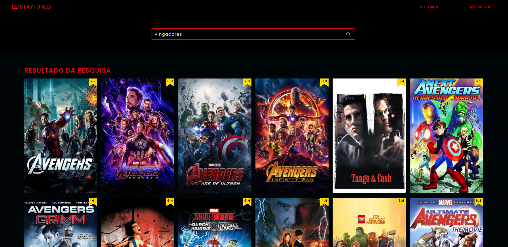

# **Stay Tuned Movie app - React JS**

## **O propósito do projeto**

O principal propósito dessa aplicação é dar a possibilidade ao usuário de pesquisar por um título de um filme e obter
toda as informações disponíves para consulta.
Ao clicar sobre o cartaz do filme o usuário é redirecionado para a página onde contém informações relevantes sobre seu título
original orçamento e arrecadação, duração, gênero, idiomas, nota no IMDB e enredo. Também é possível ver o(s) trailer(s) do filme
imagem do elenco, produção, posters e filmes similares.

## **Funcionalidades**

Na página inicial contém o carrosel onde é mostrado os filmes que estreiam no cinema durante o mês e logo abaixo está o campo de pesquisa como também todos os filmes mais populares.
O usúario pode clicar em qualquer cartaz para ser redirecionado para a página de detalhes ou digitar um termo para pesquisar um filme específico.

## **Tecnologias usadas**

- <a href="https://pt-br.reactjs.org/">React</a>
- <a href="https://reach.tech/router/">Reach Router</a>
- <a href="https://www.npmjs.com/package/react-helmet">React Helmet</a>
- <a href="https://axios-http.com/ptbr/docs/intro">Axios</a>
- <a href="https://fontawesome.com/start">Fontawesome</a>
- <a href="https://styled-components.com/">Styled-components</a>
- <a href="https://swiperjs.com/">Swiper JS</a>

## **Como instalar em ambiente local**

- Na página desse projeto no Github clique em "Code", baixe o Zip ou copie o link do HTTPS.
- Abra um terminal em uma pasta de sua escolha e cole o link HTTPS.
- Certifique-se de ter instalado o Node em uma versão superior a 14.0.
- Após baixar o pojeto em um diretório de sua escolha digite o comando "npm install".
- Após o término de todas as depedências serem baixadas pelo npm digite no mesmo diretório o comando "npm start".
- O seu navegador padrão irá mostrar uma nova aba com o projeto já pronto para ser usado
- Caso o navegado não inciar, digite o seguinte comando "http://localhost:3000" em uma nova aba.

Copyright (c) 2022 - 2022, One Blue.io
